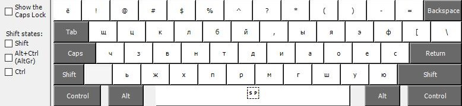
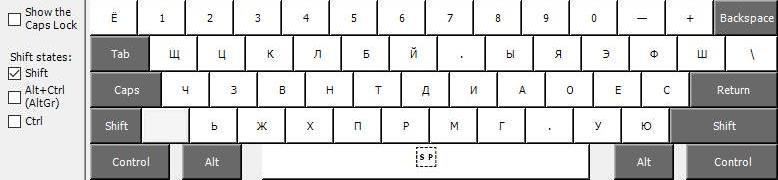

# ⌨ LeonovM

«[Leonov](https://habr.com/ru/users/lemos/) modified» keyboard layout

# 💾 Installation

## Windows

.exe file in `leonovm` folder

# 🧾 References
- [Илья Леонов — Как я оптимизировал стандартную русскую раскладку](https://habr.com/ru/articles/717912/)
- [Клавиатуры: эргономика и раскладки](https://t.me/klavaorgwork)
- [Типографская раскладка](https://ilyabirman.ru/typography-layout/)
- [«Скоропи́с» и другие раскладки](https://cont.ws/@russkivek/93620)

# 📂 Misc
- [Typerun](https://typerun.top/#rus_basic)
